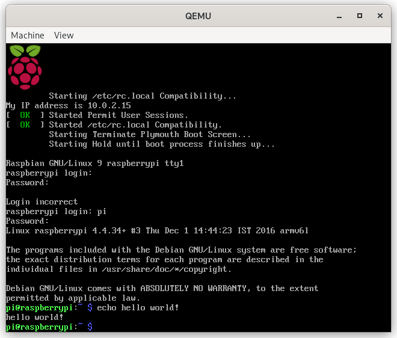

# Emulating Raspberry Pi 3b

## Step 1: Run Raspbian
- followed tutorial from: <https://blog.agchapman.com/using-qemu-to-emulate-a-raspberry-pi/>
- download the nessicary images:
```bash
wget https://github.com/dhruvvyas90/qemu-rpi-kernel/raw/master/kernel-qemu-4.4.34-jessie
wget https://downloads.raspberrypi.org/raspbian_lite/images/raspbian_lite-2017-08-17/2017-08-16-raspbian-stretch-lite.zip
unzip 2017-08-16-raspbian-stretch-lite.zip
```
- reformat the disk image:
```bash
qemu-img convert -f raw -O qcow2 2017-08-16-raspbian-stretch-lite.img raspbian-stretch-lite.qcow2
qemu-img resize raspbian-stretch-lite.qcow +6G
```
- start qemu:
```bash
sudo qemu-system-arm \
-kernel ./kernel-qemu-4.4.34-jessie \
-append "root=/dev/sda2 panic=1 rootfstype=ext4 rw" \
-hda raspbian-stretch-lite.qcow \
-cpu arm1176 -m 256 \
-M versatilepb \
-no-reboot \
-serial stdio \
-net nic -net user \
-net tap,ifname=vnet0,script=no,downscript=no
```
- running qemu suceeded:


## Step 2: Qemu runner from tutorial
- copying qemu configuration from <https://github.com/rust-embedded/rust-raspberrypi-OS-tutorials/blob/master/01_wait_forever/Makefile>
- ended up at:
```bash
qemu-system-aarch64 -M raspi3b -d in_asm -display none
```
- `-d in_asm` shows the current instructions being executed

## Step 3: Basic tutorial from osdev wiki
- follwing tutorial from <https://wiki.osdev.org/Raspberry_Pi_Bare_Bones>
### Substep A: Creating a c cross compiler
- follwing tutorial from <https://wiki.osdev.org/GCC_Cross-Compiler>
- download dependencies (see flake)
- download source code
    - <https://ftp.gnu.org/gnu/binutils/>
    - <https://ftp.gnu.org/gnu/gcc/gcc-12.2.0/>

- build binutils
```bash
export PREFIX="$PWD/out"
export TARGET=arm-none-eabi
export PATH="$PREFIX/bin:$PATH"
mkdir build-binutils
cd build-binutils
../binutils-2.39/configure --target=$TARGET --prefix="$PREFIX" --with-sysroot --disable-nls --disable-werror
make 
make install
```
- build gcc
```bash
which -- $TARGET-as || echo $TARGET-as is not in the PATH
cd ..
mkdir build-gcc
cd build-gcc
../gcc-x.y.z/configure --target=$TARGET --prefix="$PREFIX" --disable-nls --enable-languages=c,c++ --without-headers
make all-gcc
make all-target-libgcc
make install-gcc
make install-target-libgcc
```
- when getting an error about format string litterals, its a nix issue (see <https://github.com/riscv-collab/riscv-gnu-toolchain/issues/901>)

### Substep B: GNU Assembler Basics
- different sections `.text` (code) `.data` (data)
- for linker to see `_start` we need to put it in the `.global` system table
- assemble and link file with:
```bash
as -o gnu_as_hello_world.o gnu_as_hello_world.s
ld -o gnu_as_hello_world gnu_as_hello_world.o
```

### Substep C: Getting c to run
- created assember programm (see `boot.s` in `etc/init_pi`)
- created basic while loop with kernel main loop (see `kernel.o` in `etc/init_pi`)
- linked it all together with some linking magic
- for commands see makefile
- notes:
    - currently the 0 initialization of the bss doesn't seem to work and it is unclear why it needs to be 0 initialized

### Substep D: Getting rust to run
- get cargo:
```bash
cargo install xargo

xargo new kernel
cd kernel
rustup override set nightly
```
- then compiled programm (see makefile) and let it run in qemu
- had problem with it not allowing me to change variables in loops? wierd
- 

### Substep E: getting qemu-system-aarch64
- note: we clear the bss segment, since the c standard requires it!
- note: we have to recompile both binutils **and** gcc
- recompile gcc: see above, just for aarch64-elf 
- compile assemble with:
```bash
aarch64-elf-as -c src/boot.s -o target/asm/boot.o -g
aarch64-elf-ld -o target/asm/boot ./target/asm/boot.o -g

qemu-system-aarch64 -M raspi3b -nographic -kernel target/asm/boot -s -S
```
- cross compile rust with: (might have to install the target with rustup first)
```bash
export RUSTFLAGS="-C linker=aarch64-elf-ld -O"
cargo build --target aarch64-unknown-linux-gnu
```
- then linked against the bootstrapping code:
```bash
aarch64-elf-gcc -T src/linker.ld -o target/oxos.elf -ffreestanding -O2 -nostdlib target/asm/boot.o target/aarch64-unknown-linux-gnu/debug/liboxos.rlib -g
```
- that loop issue was due to optimisations, we can easily fix it by adding `-O` to our RUSTFLAGS (or maybe not, cause now were just optimising it out i guess?)

## Step 4: Get UART hello world
- created init code or mini uart (works with MMIO)
- wrote a simple programm that writes letters to the port via its polling algorithm
- had to use a special qemu command to get mini uart to work (regular uart works fine with default `-serial stdio` config)
- qemu command used: `qemu-system-aarch64 -M raspi3b -kernel target/oxos.elf -nographic -serial null -chardev stdio,id=uart1 -serial chardev:uart1 -monitor none`
- and tada it actually worked! (see screenshot)

## Current Status

- Attepting to run iso in qemu results in black screen:
```bash
qemu-system-aarch64 -machine type=raspi3b -m 1024 -cpu cortex-a53 -hda ubuntu.img
```
- According to some, it is impossible to run the default kernel in qemu


